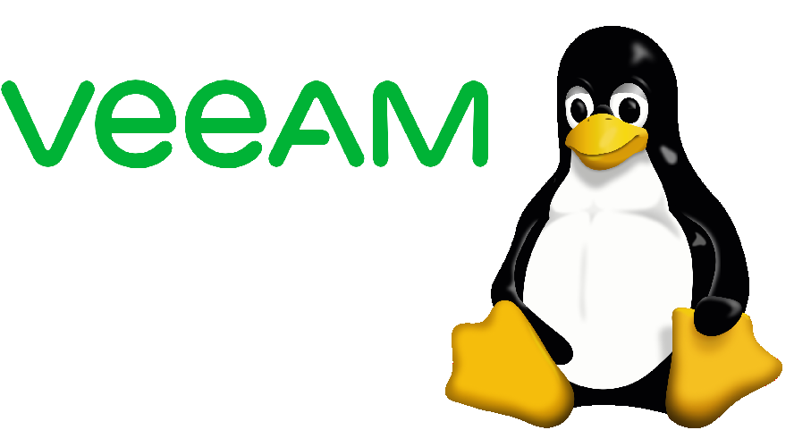

# Build an immutable backup repository for Veeam Backup & Replication. Part 2

This guide will show you, step by step, how to create and implement a disk-based immutable Veeam backup repository from scratch. In this part: Install Linux on the server.

---
## Introduction

### Purpose of these articles

You are a Windows administrator running [Veeam Backup & Replication](https://www.veeam.com/vm-backup-recovery-replication-software.html) and wish to raise protection against malware attacks and hackers without reverting to shuffle or rotate physical media.

This you can accomplish by *immutable backups* stored on a physical server running Linux.
However, you have no Linux servers running and don't want to.

But, like it or not, that is your only option, as the XFS file system is the only one capable of immutability, and XFS only runs under Linux.

Thus, a Linux server is a must. When you have accepted this fact, then what? Where to start?

Like me, you have about zero experience with Linux and, therefore, hesitate to set up a Linux server, indeed in a production environment.

If so, this guide is for you. Here, nothing about Linux is taken for granted.

### Sections

The guide has been split in eight parts. This allows you to skip parts you are either familiar with or wish to implement later if at all.

1. Prepare the install of Linux
2. Install Linux on the server
3. Prepare the Linux server for Veeam
4. Create the immutable Veeam backup repository
5. Prepare for backup of the Linux server itself
6. Backup of the Linux server itself
7. Bare Metal Recovery of the Linux server
8. Tighten security on the Linux server (MFA/2FA)

### Requirements

You are familiar with:

- the usual tasks administering at least a small network with one Windows Server
- *Veeam Backup & Replication* and have it installed and running
- the command line - from PowerShell, Command Prompt, or even DOS

> *Veeam Backup & Replication* is assumed to be of *version 11* or later.
> It can be a licensed trial or paid version or even the free [*Community Edition*](https://www.veeam.com/virtual-machine-backup-solution-free.html).

### XFS and the virtual air gap

The [XFS](https://en.wikipedia.org/wiki/XFS) file system was introduced by SGI in 1993 for its [IRIX 5.0](https://en.wikipedia.org/wiki/IRIX) operation system which was based on UNIX System V Release 4.

XFS was ported to Linux in 2001. As SGI ceased operations in 2009, Linux is today the only operating system supporting XFS.

Why is this important? Because XFS offers immutability:

> Once the file is set immutable, this file is impervious to change for any user. Even the root cannot modify, remove, overwrite, move or rename the file. You will need to unset the immutable attribute before you can tamper with the file again.

For the details about handling this, study *Dan Nanni*'s blog on Xmodulo: [How to make a file immutable on Linux](https://www.xmodulo.com/make-file-immutable-linux.html).

Other Linux file systems offer immutability, but only XFS also supports *reflink*, a technology that allows for very fast cloning of files. Veeam has assigned *reflink* its own label, [Fast Clone](https://helpcenter.veeam.com/docs/backup/hyperv/backup_repository_block_cloning.html?ver=110), and have specified this as a requirement for an immutable repository.

> The ReFS file system of Windows also supports *reflink*, but not immutability. This is why Windows Server cannot host a hardened repository.

Applying immutability to your backup files hosted on a physical server introduces a virtual *air gap* in your backup chain, protecting the backup files from anything else than direct physical access. This way, the backup files will be protected from any attack caused by advanced malware or possible hackers.

The effect is the same as if you back up to tape or DVD and, when done, remove the media from its drive.

---
## Part 2. Install Linux on the server

In this section we will install Ubuntu Server on the server machine using the USB drive (or DVD) we prepared in Part 1.

### Required hardware

These are the humble specifications to meet:

- A decent 64-bit server with at least two drives (harddisk or SSD. USB drives cannot be used).

Yes, that's all. The [requirements](https://ubuntu.com/server/docs/installation) for Ubuntu Server are very modest:

- CPU: 64-bit, 1 GHz or better
- RAM: 1 GB or more
- Disk 1: 20 GB or more for the system
- Disk 2: Large enough to hold your expected backup files

During install, also a video monitor and keyboard is required.

This means that just about any server of decent quality, you may have in stock, can be used, indeed for an initial test. If you have no server, a small server like *HPE MicroServer* will do.

### Required network

Neither should the network requirements represent a challenge for you:

- An internet connection is required for downloading updates to the installer
- A fixed IP address (or a hostname and DNS entry) should be allocated for the machine and held ready
- The address of the gateway to use
- The addresses for the nameservers to use. Use those of your local network or those of your ISP. If none of these are known, fall back to those of Google:

		8.8.8.8
		8.8.4.4

> Note that for network configuration of Ubuntu Server, the subnet mask (netmask) must be specified using the *CIDR notation* having this format:
>
> 		xxx.xxx.xxx.xxx/p
> like:
>
> 		192.168.1.0/24
>
> This is normally not used in the Windows world, so be prepared.
>
> More info at [CertificationKits - IP Addressing & Formats & Subnet Masks](https://www.certificationkits.com/cisco-certification/ccna-articles/cisco-ccna-network-layer-conceptslayer-3/ip-addressing-a-formats-a-subnet-masks/)

### Install Ubuntu Server

When ready, insert your install media and boot the machine.

When booted, **GRUB** will load. This is a widely used Linux boot loader allowing you to do various things at boot time, like selecting between several OS installs.

We have only one wish - to install Ubuntu Server - which is selected by default:

Press Enter to load the Ubuntu Server *welcome* screen:

Select the language you wish to use. Here *English (US)* is chosen.

Press Enter. This will open the *keyboard configuration* screen:

Select the keyboard layout and tab to make *Done* at the bottom having a green display.

Press Enter to open the *Network connections* screen.

### Network

The *Network connections* screen lists the options for connection to the network.

- If the machine has one network interface installed, this will be listed.
- If the machine has two or more network interfaces installed, these will be listed as well as an option to bond (team) these.

Select either a network interface or the option to bond several. Here we have selected to bond the two network interfaces found:

Press Enter and the *Create bond* window opens:

Use the default settings, unless you have some special requirement. Tab to *Create* and press Enter to display the modified settings:

Select the bond and select in the pop up menu *Edit IPv4*:

This will allow you to configure it using DHCP or a fixed address. The latter is what want, so select *Manual*:

Press Enter, and you can edit the manual *bond configuration*:

Above the configuration has been filled in with typical values. Carefully adjust these to match your environment exactly.

When ready, tab to *Save* and press Enter. The network configuration will now list your bond (or single network interface) having a *static* address:

Tab to *Done* and press Enter, and you can configure a proxy:

Leave *blank* for none, tab to *Done* and press Enter to reach the window where you can specify which *archive mirror* to use:

A mirror is a server hosting updates and optional installs, which you will need. By default, the closest to you has been selected. Use this. Tab to *Done* and press Enter to reach the disk configuration screen.

### Storage (disk)

The *Guided storage configuration* screen makes it smooth to configure the system disk, which is all we need at this point:

At top, select to *Use an entire disk* and select the (small) disk to hold the operating system. Then tab to *Done* and press Enter to open the *Storage configuration* status:

The important part is the top block, FILE SYSTEM SUMMARY, which should list the partitioning of the boot disk. If this doesn't seem correct, tab to *Back* and correct. Nothing has yet been written to the disks, so you can go back and forth as needed until it is correct.

If everything is OK, tab to *Done*, press Enter, and the confirm window will pop up:

If OK, tab to *Continue* and press Enter to reach the final parts of the initial setup.

### Profile

The *Profile setup* screen let's you:

- Enter the name of the server (the hostname)
- Create your administrator account

> This is the account you later will use in *Veeam Backup & Recovery Console*.

Fill in the fields like this example:

Tab to *Done* and press Enter to proceed to the SSH screen.

> SSH is an important option. It *must be selected*, or Veeam will not be able to set up the Linux agent and the repository. Further, SSH allows you to securely remote control the server from, say,  PowerShell after the initial installation.
>
> If you are very concerned about security, SSH may later be protected by MFA/2FA authentication, be deactivated, or even removed.

Install SSH is selected by default:

Tab to *Done* and press Enter. This will open the list of *Featured Server Snaps* which are supplemental programs and features optionally to be included in the initial install:

Of these, you will need none for this project, thus move to *Done* and press Enter.

The installation will now proceed and take a little time. When ready, the end of the install log is displayed:

Tab to *Reboot*, press Enter, and remove the installation media:

### Installation ready

After the reboot:

the text listings will settle after a while, and the minimalistic login message of Linux is displayed:

To login, type your account name and then your password (which will not be shown):

Enjoy the welcome message!

What you see on the Linux screen it the *Bash Shell* - a command line interface for Linux similar to *PowerShell* for Windows.

### Remote control

As we above included *SSH Server* in the installation, we will be able to connect to and remote control the Linux server from an *SSH client*.

This is where PowerShell comes in; in addition to all the other tasks, that PowerShell can handle, it can act as an *SSH client*, and that we will utilise onwards.

The command is this simple:

	ssh username@hostname
or:

	ssh username@ip-address

For the very first attempt, it will ask for a confirmation about the key to use to make the connection safe. Type **yes** (not just **y**), and it will prompt for the password.

Enter the password, and the welcome message will be listed:

From now on, we will user PowerShell to interact with the Linux server, as that allows for easy copy/paste of commands and console output.

### Conclusion

The server now has a basic Ubuntu installation and is ready for the next step - preparing it for installation of the immutable backup repository - which is explained in detail in **Part 3** of this series:

[Build an immutable backup repository for Veeam Backup & Replication. Part 3](https://github.com/GustavBrock/Veeam.Linux/blob/main/Linux%20Repository%203.md)
